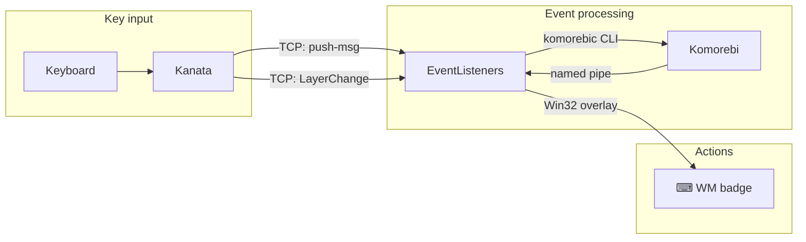
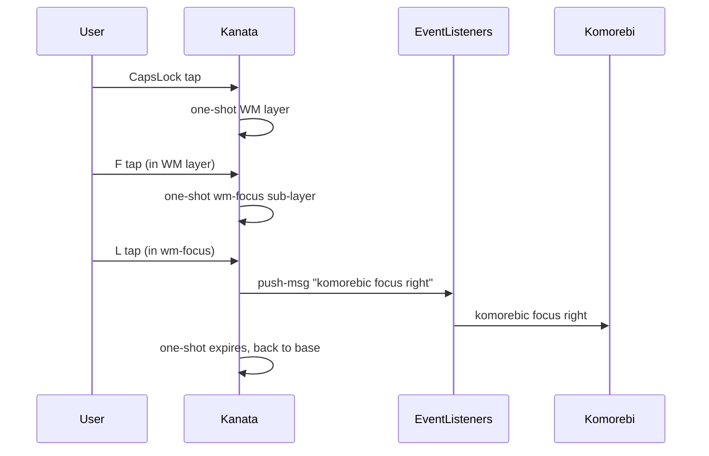
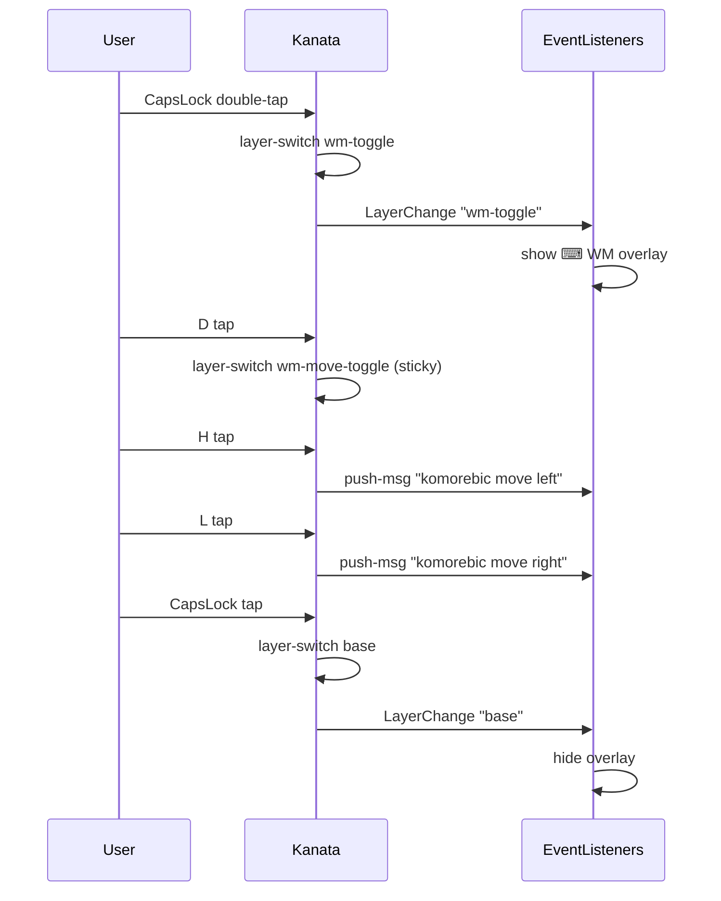

# Unified Keyboard Navigation

A CapsLock-layer system for keyboard-driven window management on Windows,
built on [kanata], [komorebi], and [whkd].

## Design principles

1. **One direction cluster** - HJKL everywhere
2. **Prefix mode** - single tap = one-shot prefix, double tap = toggle for multi-step
3. **Home-row sub-modifiers** - S/D/F/E/A select the operation scope
4. **Sticky toggle sub-layers** - in toggle mode, sub-mods stay active until switched
5. **Unmapped keys = deadkeyed** - no accidental typing in WM mode
6. **Mode indicator** - overlay window shows ⌨ WM badge when active

## Architecture



### Message flow: one-shot prefix, focus right



### Message flow: toggle mode, move windows



## Keymap

See [KEYMAP.md](KEYMAP.md) for the complete reference card.

### Sub-modifier layout (left hand)

```
            E(xpand)
  A(ssemble) S(tack) D(isplace) F(ocus)
```

In one-shot mode, tap a sub-modifier then tap a direction.
In toggle mode, tap a sub-modifier to enter that mode (sticky).

## Startup (wpmd)

```
desktop (oneshot, autostart)
├── komorebi (requires whkd)
│   └── whkd
├── komorebi-bar-1 (requires komorebi)
├── komorebi-bar-2 (requires komorebi)
├── kanata --port 9999
└── event-listeners (requires komorebi)
```

## Phase 2: per-app inner navigation (planned)

The event-listeners service will coordinate kanata layer state with
komorebi focus events (replacing komokana). When CapsLock is active and a
mapped app is focused, bare HJKL will send app-specific navigation:

| App | h | j | k | l |
|-----|---|---|---|---|
| Terminal | psmux pane left | pane down | pane up | pane right |
| Chrome | history back | next tab | prev tab | history forward |
| Teams | prev region | next chat | prev chat | next region |

[kanata]: https://github.com/jtroo/kanata
[komorebi]: https://github.com/LGUG2Z/komorebi
[whkd]: https://github.com/LGUG2Z/whkd
