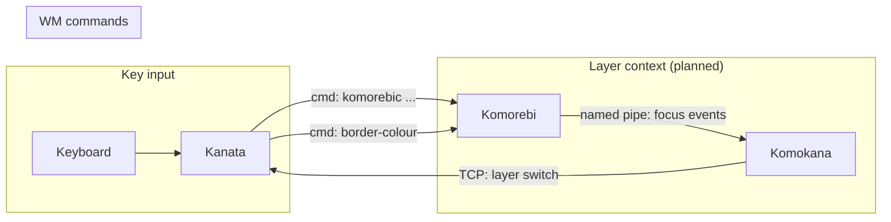
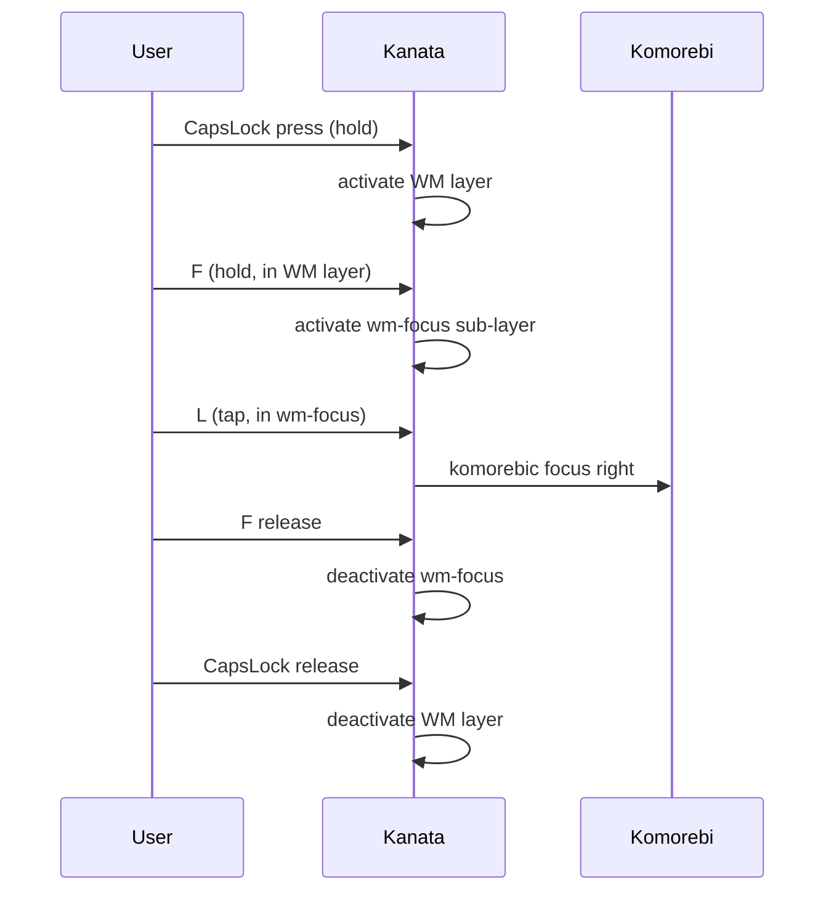
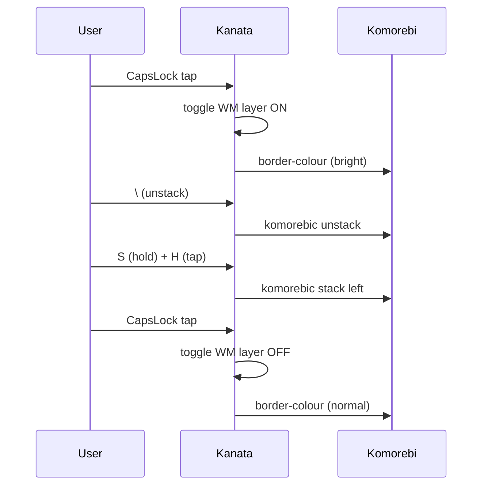

# Unified Keyboard Navigation

A CapsLock-layer system for keyboard-driven window management on Windows,
built on [kanata], [komorebi], [whkd], and (planned) [komokana].

## Design principles

1. **One direction cluster** - HJKL everywhere
2. **Opposite-hand rule** - left hand anchors/modifies, right hand directs
3. **Hold/toggle symmetry** - every operation works in both modes
4. **Home-row sub-modifiers** - S/D/F/E select the operation scope
5. **Unmapped apps = passthrough** - bare HJKL does nothing in unknown apps
6. **Mode indicator** - border brightness shift signals WM mode

## Architecture



### Message flow: hold CapsLock, focus right



### Message flow: toggle mode, unstack and restack



## Keymap

See [KEYMAP.md](KEYMAP.md) for the complete reference card.

### Sub-modifier layout (left hand, CapsLock held or toggled)

```
         E(xpand)
  S(tack)  D(isplace)  F(ocus)
```

Each sub-modifier is held with a different finger while CapsLock is held
with the pinky. In toggle mode, all fingers are free.

## Startup (wpmd)

```
desktop (oneshot, autostart)
├── komorebi (requires whkd)
│   └── whkd
├── komorebi-bar-1 (requires komorebi)
├── komorebi-bar-2 (requires komorebi)
├── kanata --port 9999
├── komokana (requires komorebi, kanata)  ← planned
└── event-listeners (requires komorebi)
```

## Phase 2: per-app inner navigation (planned)

A state controller will coordinate kanata layer state with komokana's
app-focus detection. When CapsLock is active and a mapped app is focused,
bare HJKL will send app-specific navigation:

| App | h | j | k | l |
|-----|---|---|---|---|
| Terminal | psmux pane left | pane down | pane up | pane right |
| Chrome | history back | next tab | prev tab | history forward |
| Teams | prev region | next chat | prev chat | next region |

[kanata]: https://github.com/jtroo/kanata
[komorebi]: https://github.com/LGUG2Z/komorebi
[whkd]: https://github.com/LGUG2Z/whkd
[komokana]: https://github.com/LGUG2Z/komokana
