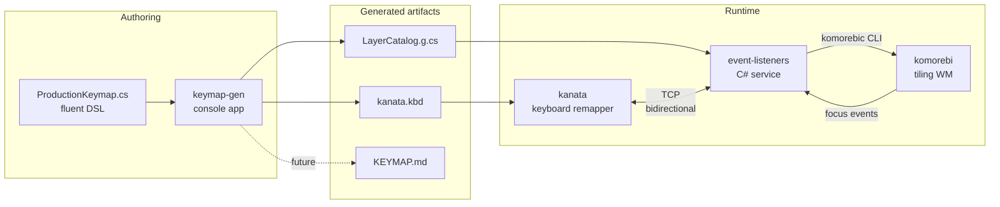

# Unified Keyboard Navigation

A CapsLock-layer system for keyboard-driven window management on Windows,
built on [kanata] and [komorebi]. App-specific behavior (e.g. psmux pane nav
in Windows Terminal) layers on top via overlays selected by the focused app.

This directory contains the *source* of the keymap, expressed in a small C#
DSL that compiles to a flat `kanata.kbd`. The DSL exists because kanata can't
express overlays natively; we author overlays as we think about them and let
a compiler flatten them into layers kanata can run.

## Mental model

Tap CapsLock to enter "WM mode". The layer stack you're working in:

```
+---------------------------------+
| App overlay (if focused)        |  e.g. wm-terminal -- adds psmux nav on HJKL
+---------------------------------+
| Sub-modes (a / s / d / f / e)   |  e.g. wm-focus -- HJKL means focus, not move
+---------------------------------+
| wm-base (always)                |  reserved globals (r, p, tab, /) + sub-mode entries
+---------------------------------+
```

- Tap CAP once = **one-shot** WM mode (auto-exits after one action).
- Tap CAP twice = **toggle** WM mode (sticky; CAPS exits).
- In WM mode, the home-row letters `a/s/d/f/e/w` enter sub-modes.
- Sub-modes scope what HJKL means: focus / move / stack / resize / assemble / workspace.
- App overlays only bind keys *not* claimed by wm-base or sub-mode entries.
- Sub-mode entries (asdfwe) and globals (r/p/tab/q/g/`/`) are reserved and
  cannot be overridden by overlays.

### Overlays that act as prefix forwarders

An overlay can rebind its non-WM keys to fire a macro that emits a prefix
chord plus the original key. Example: the terminal overlay rebinds letters,
digits, and common symbols to `(macro C-b <key>)`. So inside the terminal:

- `CAP h` enters `wm-terminal` (one-shot) and fires `Ctrl+b h` — psmux
  pane-left.
- `CAP 1` fires `Ctrl+b 1` — psmux select-window 1 (digits route through
  an `unmod` macro step to dodge kanata's macro-grammar quirk where a bare
  integer means "delay in milliseconds").
- `CAP \` fires `Ctrl+b \` — psmux split-vertical (from pain-control).
- `CAP CAP h` enters `wm-terminal-toggle` (sticky) and fires the same macro.
- `CAP w` (and other sub-mode entries `asdfew`) still enters the workspace
  sub-mode because wm-base's reserved keys aren't shadowed by overlays.

Default prefixed key set:

- Letters: `b c g h i j k l m n o t u v x y z`
- Digits: `0 1 2 3 4 5 6 7 8 9` (emitted via `(unmod N)`)
- Symbols: `, . \ - [ ] ;`

Authored via `LayerBuilder.PrefixAll(prefix, keys...)`. Reserved wm-base
keys (sub-mode entries `a s d f e w`, globals `r p tab q /`, and arrows)
are skipped by the validator and never reach the terminal app via CAP.

#### psmux rebinds for CAP-reachable keys

Because the reserved keys above never reach psmux through CAP, the default
psmux bindings that lived on them are mapped onto letters that ARE in the
PrefixAll set. See `psmux/.psmux.conf`:

| Original | Rebound to | Action |
| --- | --- | --- |
| `p` | `b` | previous-window (back) |
| `w` | `v` | choose-tree -Zw (view windows) |
| `s` | `m` | choose-tree -Zs (session menu) |
| `q` | `g` | display-panes (grid) |
| `d` | `u` | detach-client (unattach) |

`find-window` and other rarely used commands remain reachable via the
psmux command prompt (`CAP :` then type the command).

While WM mode is active, komorebi's border around the focused window turns
green. It sits wherever you are already working, on whichever monitor, so it
reads without looking away.


## System architecture



### What kanata does

Owns key remapping. Reads `kanata.kbd` (compiler output) and intercepts the
keyboard. Two output paths:

1. **`push-msg`** — emits a string over TCP. Used for actions that invoke a
   running program (komorebic, wt). The bridge consumes these and dispatches.
2. **`macro`** — emits literal keystrokes. Used for app-specific shortcuts
   inside overlays (e.g., Ctrl+b + h in wm-terminal for psmux). No bridge
   involvement; kanata writes directly to the focused window.

The selected pointer architecture assigns continuous pointer motion, wheel, and
physical button taps to Kanata. Its native accelerated movement composes
independent axes for diagonals and stops each axis on that key's release,
without a second keyboard listener or a pressed-state transport.

A future Mousemaster replacement owns only cursor/hint overlays, UI Automation
target discovery, semantic activation, and point-only cursor placement. It has
no keyboard hook and does not duplicate Kanata's continuous pointer state.

Mousemaster remains the production owner until bindings and cutover are
designed. The deterministic native-pointer contract lives in
`EventListeners.Tests/Kanata/KanataNativePointerSimulatorTests.cs`.

### What the bridge (event-listeners) does

Plain C# console app, hosted as a wpm service. Three responsibilities:

1. **`IntentDispatchRule`** — maps `wm.*` / `system.*` intent strings from
   kanata's `push-msg` to CliWrap commands (typically `komorebic <verb>`).
2. **`AppLayerRouter`** — subscribes to komorebi focus events, runs an
   ordered chain of C# routing rules, and sends `ChangeLayer` to kanata.
   The single rule today: `WindowsTerminal.exe → base-terminal`.
3. **`WmBorderIndicator`** — subscribes to kanata `LayerChange` events and
   recolours komorebi's focused-window border while a WM mode is active.

All three share a single long-lived bidirectional TCP connection to kanata
(see `KanataEventListenerService`).

### What the compiler does

Lives in `keymap-gen/`. Reads `ProductionKeymap.cs` (the DSL) and emits:

- **`kanata/kanata.kbd`** — a flat set of kanata layers. For each declared
  overlay, the compiler generates `base-{name}`, `wm-{name}`, and
  `wm-{name}-toggle` layers, merging wm-base bindings + sub-mode entries +
  overlay-specific bindings (in that order, overlay last so it wins on conflicts).
- **`komorebi/event-listeners/Generated/LayerCatalog.g.cs`** — string
  constants for every layer name. The bridge router references these so a
  typo in a routing rule is a compile error.

Run via `keyboard/regen.ps1`.

#### Compile-time invariants enforced

- Overlay binds a reserved key (asdfwe, r/p/tab/...) → fail
- Same key bound twice in same layer → fail
- Macro references an unknown step kind → fail

### Why the DSL/bridge split

The DSL owns the **keymap** (what layers exist, what keys do what). The
bridge owns the **routing strategy** (which layer should be active for the
current focus).

The split exists because routing wants flexibility kanata can't express:
window title regex, focus class, time of day, etc. Bridge code is plain C#
and easy to evolve. Adding a simple app overlay is two small edits:

1. `ProductionKeymap.cs`: define the overlay layer with `.Overlay(...)`
2. `AppLayerRouter.cs`: add a one-line rule referencing the new
   `LayerCatalog.Base<Name>` constant

### Why intents vs macros

| | Intent (`push-msg`) | Macro |
|---|---|---|
| Path | kanata → TCP → bridge → CliWrap | kanata → keystrokes → focused window |
| Latency | sub-ms | sub-ms |
| Best for | invoking a program (komorebic) | sending shortcuts to the focused app |
| Example | `wm.focus.left` → `komorebic focus left` | `(macro C-b h)` for psmux pane left |

Add a new intent when the action requires running a process. Add a macro when
it's a keystroke sequence the focused app understands natively.

## Focus tracking

The bridge listens to komorebi's `FocusChange` events. **Komorebi is the
single source of truth for focus.** When focus moves to an unmanaged window
(elevated process, transient dialog, unmanaged exe), komorebi doesn't fire
the event and the previously-set overlay stays active until the next managed
focus change. This is an accepted trade-off — the alternative (Win32
`SetWinEventHook` as a second focus source) creates two competing definitions
of focus and added complexity for an edge case.

## Layer naming convention

| Pattern | Purpose | Border |
|---|---|---|
| `base-*` | Focus-context typing layers (just remap CAP) | Resting |
| `wm` | Default one-shot WM mode | Green |
| `wm-toggle` | Default sticky WM mode | Green |
| `wm-<name>` | Per-overlay one-shot WM (e.g. `wm-edge`) | Green |
| `wm-<name>-toggle` | Per-overlay sticky WM | Green |
| `wm-<submode>` | Sub-mode one-shot (e.g. `wm-focus`) | Green |
| `wm-<submode>-toggle` | Sub-mode sticky | Green |

The border says only whether a WM mode is active, not which one: `wm` and
`wm-*` are green, everything else rests on the colour komorebi's theme gives
that window arrangement.

## How to ...

### Add an app overlay

Example: open the Edge URL bar with `CAP+u` when Edge is focused.

1. Edit `keymap-gen/ProductionKeymap.cs`:
   ```csharp
   .Overlay("edge", b => b
       .Macro("u", "C-l"))    // CAP+u sends Ctrl+L when Edge is focused
   ```
2. Edit `komorebi/event-listeners/AppLayerRouter.cs` `DefaultRules`:
   ```csharp
   ctx => ctx.Exe == "msedge.exe" ? LayerCatalog.BaseEdge : null,
   ```
3. Run `keyboard/regen.ps1` (validates output with kanata, regenerates files).
4. `wpmctl restart kanata event-listeners`.

### Add a global command

Example: bind `CAP+z` to toggle workspace zoom.

1. Edit `keymap-gen/ProductionKeymap.cs`, add to `WmBase` and the
   `Reserve(global: [...])` list (so overlays can't claim `z`):
   ```csharp
   .Reserve(global: [..., "z"], ...)
   .WmBase(b => b
       ...
       .Intent("z", "wm.layout.toggle-zoom"))
   ```
2. Edit `komorebi/event-listeners/IntentDispatchRule.cs` `BuildCommandMap`:
   ```csharp
   map["wm.layout.toggle-zoom"] = () => Komorebic("toggle-zoom");
   ```
3. Add to `keyboard/INTENTS.md` under the Layout / mode table.
4. `keyboard/regen.ps1` + restart services.

### Add a routing rule that needs more than exe match

Example: route Edge to `base-edge`, but only when the URL bar contains
"github.com" — fallback to default otherwise.

Only the bridge changes. The DSL has no concept of routing.

```csharp
// AppLayerRouter.DefaultRules:
ctx => (ctx.Exe == "msedge.exe" && ctx.Title?.Contains("github.com") == true)
    ? LayerCatalog.BaseEdge : null,
```

### Debug a misbehaving layer

```pwsh
# Tail the bridge log -- focus changes, layer transitions, intent dispatches
Get-Content "$env:LOCALAPPDATA\wpm\logs\event-listeners.log" -Wait -Tail 30

# Tail kanata's log -- internal state machine messages
Get-Content "$env:LOCALAPPDATA\wpm\logs\kanata.log" -Wait -Tail 30

# Sniff kanata's TCP traffic directly (Powershell client):
# {"LayerChange":{"new":"base-default"}}
# ...
```

For unit tests of layer behavior (without disturbing your keyboard):

```pwsh
cd komorebi/event-listeners
dotnet test EventListeners.Tests --filter "Category=KanataHarness"
```

The harness uses a patched `kanata_simulated_input.exe` (see `kanata/sim/`)
to run kanata config logic in-memory. Tests live in
`EventListeners.Tests/Kanata/`.

## Service startup

Managed by [wpm]. Dependencies:

```
desktop (oneshot, autostart)
├── komorebi
├── komorebi-bar
├── kanata --port 9999
└── event-listeners
```

## Related files

- `keyboard/INTENTS.md` — vocabulary of `wm.*` / `system.*` intents
- `keyboard/KEYMAP.md` — per-key reference (auto-generated from the DSL)
- `keyboard/keymap-gen/ProductionKeymap.cs` — *the* source of truth for the keymap
- `keyboard/regen.ps1` — regenerate all artifacts
- `kanata/sandbox/` — Phase 0 validation kbd files (reference for kanata mechanics)
- `kanata/sim/` — patched simulator binary used by tests

[kanata]: https://github.com/jtroo/kanata
[komorebi]: https://github.com/LGUG2Z/komorebi
[wpm]: https://github.com/LGUG2Z/wpm
